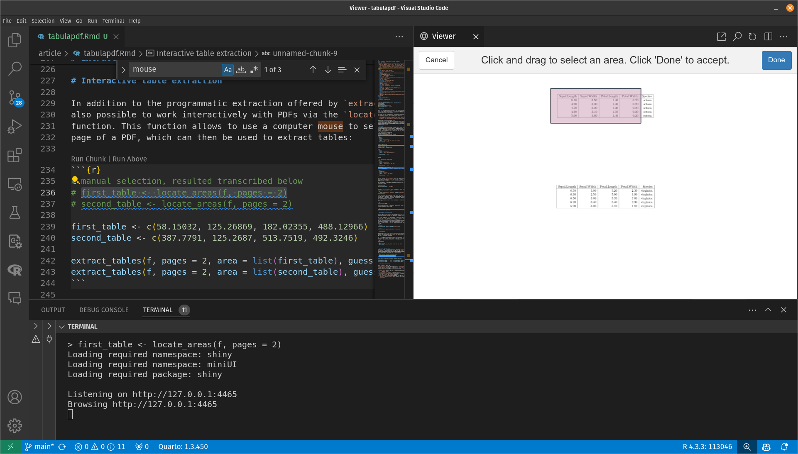

# Introduction

For the user who needs raw data, PDF is not the right choice
[@pdfhammer; @dataversusinformation]. Even if a PDF file is created with a
spreadsheet tool such as Microsoft Excel, the resulting file does not contain
information about the data structure (i.e., rows and columns). The
PDF format was created as digital paper and one of its purposes was to share
information, this is, communicating interpretations and conclusions,
something different from sharing figures that usually belong in a database
[@dataversusinformation; @updatingdollars].

Tabula is a multi-platform tool written in Java for extracting tables in PDF
files. For the previous reasons, extracting data provided in PDFs can be
challenging and time-consuming, and this tool allows to extract tables into a
CSV or Microsoft Excel spreadsheet using a simple, easy-to-use interface.

One notable use case for Tabula is in investigative journalism, and it was
used to produced parts of the following stories [@tabula]:

  - [The New York Times: "What Happens After Calls for New Gun Restrictions? Sales Go Up"](https://www.nytimes.com/interactive/2015/12/10/us/gun-sales-terrorism-obama-restrictions.html?_r=1)
  - [Foreign Policy: "Money Down the Drain: CRS Report Details U.S. Expenses on Iraq"](https://foreignpolicy.com/2014/06/13/money-down-the-drain-crs-report-details-u-s-expenses-on-iraq/)
  - [ProPublica: How Industry Dollars Reached Your Doctors](https://projects.propublica.org/docdollars/)

\pkg{tabulapdf} provides R bindings to the
[Tabula java library](https://github.com/tabulapdf/tabula-java/), which can be
used to computationally extract tables from PDF documents, and allows to
directly import tables into R in an automated way or by allowing user to
manually select them with a computer mouse thanks to its integration with
\CRANpkg{shiny} [@shiny].

# Basic usage

We will demonstrate \pkg{tabulapdf} usage by reading tables from a PDF file
created with Quarto [@quarto] and with data available in @base. The file,
included in the package, contains four tables, with the second and third tables
being on the second page to show a frequent use case that posits some challenges
for table extraction, and it can be accessed from
[GitHub](https://github.com/ropensci/tabulapdf/blob/main/inst/examples/mtcars.pdf).

The main function, `extract_tables()`, mimics the command-line behavior of
Tabula, by extracting tables from a PDF file and, by default, returns those
tables as a list of tibbles in R, where the column-types are inferred by using
\CRANpkg{readr} [@tidyverse].

The starting point is to load the package and, optionally, to set the memory
allocation for Java:

```{r}
library(tabulapdf)

# optional: set memory for Java
options(java.parameters = "-Xmx50m")
```

By default, `extract_tables()` checks every page for tables using a detection
algorithm and returns all of them:

```{r}
f <- system.file("examples", "mtcars.pdf", package = "tabulapdf")
extract_tables(f)
```

As you can see for the second table in the output, the result is not perfect
with the default parameters, which is why \pkg{tabulapdf} provides additional
functionality to improve the extraction. In some cases the extraction should
work without additional arguments.

The `pages` argument allows to select which pages to attempt to extract
tables from:

```{r}
extract_tables(f, pages = 1)
```

It is possible to specify a remote file, which will be copied to a temporary
directory internally handled by R:

```{r, eval = FALSE}
f2 <- "https://raw.githubusercontent.com/ropensci/tabulapdf/main/inst/examples/mtcars.pdf"
extract_tables(f2, pages = 1)
```

# Specifying the extraction method

For each page, `extract_tables()` uses an algorithm to determine whether it
contains one consistent table and then extracts it by using a
spreadsheet-tailored algorithm with the default parameter `method = "lattice"`.

The correct recognition of a table depends on whether the page contains a table
grid. If that is not the case, and the table is a matrix of cells with values
without borders, it might not be able to recognise it.

The same issue appears when multiple tables with different number of columns are
present on the same page. In that case, the parameter `method = "stream"` 
can be a better option as it will use the distances between text characters on
the page:

```{r}
# incorrect
extract_tables(f, pages = 2, method = "lattice")[[1]]

# correct
extract_tables(f, pages = 2, method = "stream")[[1]]
```

# Extracting areas

\pkg{tabulapdf} uses a table detection algorithm to automatically
identify tables within each page of a PDF. This automatic detection can be
disables with the parameter `guess = FALSE` and specifying an area within each
PDF page to extract the table from.

The `area` argument should be a list either of length equal to the number of
pages specified, allowing the extraction of multiple areas from one page if
the page is specified twice and with two areas separately:

```{r}
extract_tables(
  f,
  pages = c(2, 2),
  area = list(c(58, 125, 182, 488), c(387, 125, 513, 492)),
  guess = FALSE
)
```

# Interactive table extraction

In addition to the programmatic extraction offered by `extract_tables()`, it is
also possible to work interactively with PDFs. The `locate_areas()` function
allows to use a computer mouse to select areas on each page of a PDF, which can
then be used to extract tables:

```{r, out.width = "100%", out.height = "30%", fig.cap = "Selecting areas for table extraction.", fig.alt = "Selected area in a table shown as a red rectangle with transparency over a simple table with black borders and text in white background.", echo = FALSE}

```

The selection from Figure 1 can be used to extract the tables as follows:

```{r}
# manual selection, result transcribed below
# first_table <- locate_areas(f, pages = 2)[[1]]
# second_table <- locate_areas(f, pages = 2)[[1]]

first_table <- c(58.15032, 125.26869, 182.02355, 488.12966)
second_table <- c(387.7791, 125.2687, 513.7519, 492.3246)

extract_tables(f, pages = 2, area = list(first_table), guess = FALSE)
extract_tables(f, pages = 2, area = list(second_table), guess = FALSE)
```

# Use case: COVID-19 treatments in Italy

It is possible to extract the tables containing the number of pharmaceutical
treatments for hospitalized patients from the *Monitoraggio Antivirali per
COVID-19* (Antiviral Monitoring for COVID-19) [@agenzia].

It is not the case for this data, but combined cells in the header can difficult
the extraction process. It is possible to select the figures only and set the
`col_names` argument to `FALSE` to avoid this issue.

The following code downloads and tidies the table for the first report:

```{r}
f <- system.file("examples", "covid.pdf", package = "tabulapdf")

# this corresponds to page four in the original document
# locate_areas(f, pages = 1)

covid <- extract_tables(f,
  pages = 1, guess = FALSE, col_names = FALSE,
  area = list(c(140.75, 88.14, 374.17, 318.93))
)

covid <- covid[[1]]

colnames(covid) <- c("region", "treatments", "pct_increase")
covid$treatments <- as.numeric(gsub("\\.", "", covid$treatments))
covid$pct_increase <- as.numeric(
  gsub(",", ".", gsub("%", "", covid$pct_increase))
) / 100

covid
```

# Miscellaneous functionality

Tabula is built on top of the
[Java PDFBox library](https://pdfbox.apache.org/) [@apachepdfbox], which
provides low-level functionality for working with PDFs. A few of these tools are
exposed through \pkg{tabulapdf}, as they might be useful for debugging or
generally for working with PDFs. These functions include:

 - `extract_text()` converts the text of an entire file or specified pages into
    an R character vector.
 - `extract_metadata()` extracts PDF metadata as a list.
 - `get_n_pages()` determines the number of pages in a document.
 - `get_page_dims()` determines the width and height of each page in pt (the
    unit used by `area` and `columns` arguments).
 - `make_thumbnails()` converts specified pages of a PDF file to image files.
  - `split_pdf()` and `merge_pdfs()` split and merge PDF documents,
    respectively.
